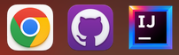

# “VisualVault: Tu Reserva Audiovisual”

      

1. [Que es “VisualVault: Tu Reserva Audiovisual” -- Descripción](#quees)
2. [Como funciona “VisualVault: Tu Reserva Audiovisual” -- Funcionamiento](#comofunciona)
3. [Estado del proyecto](#estado)
4. [Características de la aplicación y demostración](#caracteristicas)
5. [Tecnologías utilizadas](#tecnologias)
6. [Conclusión](#conclusion)
7. [Como surgió la idea](#idea)  
- - -

## 1. ¿Qué es “VisualVault: Tu Reserva Audiovisual”? -- Descripcion 
VisualVault: Tu Reserva Audiovisual, es una App de escritorio en Java, la cual tiene como finalidad 
almacenar los datos de películas, series y documentales, entre otros contenidos audiovisuales. 
Es una biblioteca para guardar los datos de tus contenidos audiovisuales favoritos.  
- - -

## 2. ¿Cómo funciona “VisualVault: Tu Reserva Audiovisual”? -- Funcionamiento
Al iniciar la App, automaticamente se abre una ventana en la que a primera vista se diferencian dos apartados. 
Uno a la izquierda y otro a la derecha.

En el apartado izquierdo hay dos botones, uno para hacer login y otro para las configuraciones, 
a continuación aparecerá una barra de búsqueda, debajo aparecerá nuestra lista de elementos 
y en la parte inferior, un botón para añadir mas elementos a lista. Éste botón nos abrirá otra ventana 
para rellenar la información del nuevo elemento.

En el apartado de la derecha aparecerá el titulo de la App, la información del elemento que esté seleccionado
en la lista del apartado izquierdo y un botón que llevará a un trailer de Youtube.  
- - -

## 3. Estado del proyecto
El estado del proyecto está en proceso, ya que se ha empezado este verano. Mi intención de seguir con él y 
conseguir dejar una App totalmente funcional, completa, fácil de usar y sobre todo útil. 

En un futuro próximo, tengo pensado migrar los datos a una API gratis, puesto que ahora mismo la permanencia 
de los datos es local. Y sobre todo, mi intención adaptarla para iOS y Android.   
- - -

## 4. Características de la aplicación y demostración
Al abrir la App, aparece una ventana en la que diferencian dos apartados:
-  El apartado de la izquierda, ocupa practicamente una cuarta parte de la ventana y está formado por 4 secciones divididas horizontalmente.   

    - La primera parte: 
      - [Botón de Login](#botonlogin)
      - Botón de Configuraciones   
      
    - Segunda parte:
      - Texto titulo
      - Icono cronómetro   
      
    - Tercera parte:
      - Lista de elementos 
      - Número de duracion de minutos del elemento   
    
    - Cuarta Parte:
      - Botón Añadir (Abre otra ventana nueva)   

-  El apartado de la derecha, ocupa practicamente tres cuartas partes de la ventana y está formado por 2 secciones divididas por un recuadro central.   

    - La parte exterior del recuadro:
      - Titulo y logo de la App   

    - La parte interior del recuadro. La cual también está dividida en dos partes: 
      - Parte izquierda
        - Campos descriptivos
        - Campos a rellenar   
      - Parte Derecha
        - Imagen Portada
        - Botón Trailer   

- - -

## 5. Tecnologías utilizadas
En este proyecto se han utilizado las siguientes tecnologías: 
- Google
- GitHub Desktop 
- IDE: IntelliJ 

- - -

## 6. Conclusión
A día de hoy puedo dar una conclusión, pero no final, ya que como comentaba el proyecto no está ni mucho menos acabado. 

Dedicar mi tiempo en este pequeño proyecto ha servido para poder seguir adquiriendo confianza y motivación, 
ya que me he encontrado con nuevos problemas y los he superado.

En resumidas cuentas, mi conclusión actual, es que este proyecto me ha sido beneficioso en todos los aspectos.   
- - -

## 7. Como surgió la idea

Esta idea surgió hablando con un amigo, el cual pasa muchas horas viendo series y películas. 
Me dijo que con todas las plataformas que hay, cada vez cuesta más de escoger una película o una serie y 
que al final casi siempre ve las mismas. Le contesté que se hiciese una lista de películas
clasificadas como a él le conviniese y no perdería tanto tiempo.

Entonces pensé que podía crear una biblioteca personal en la que cada usuario pueda añadir 
los nombres y datos de películas o series que le interese, pudiéndose clasificar por carpetas y demás,
de esa manera no se perdería tanto tiempo buscando y viendo portadas de películas que no te interesan.   
- - -

Boton de Login
jhgf
kjhg
lkjhg
lkjhg
