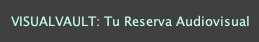

# VISUALVAULT: Tu Reserva Audiovisual  

  

1. [Que es VISUALVAULT: Tu Reserva Audiovisual -- Descripción](#quees)
2. [Como funciona VISUALVAULT: Tu Reserva Audiovisual -- Funcionamiento](#comofunciona)
3. [Estado del proyecto](#estado)
4. [Características de la aplicación y demostración](#caracteristicas)
5. [Tecnologías utilizadas](#tecnologias)
6. [Conclusión](#conclusion)
7. [Como surgió la idea](#idea)  
- - -

## 1. ¿Qué es “VisualVault: Tu Reserva Audiovisual”? -- Descripcion 
VisualVault: Tu Reserva Audiovisual, es una App de escritorio en Java, la cual tiene como finalidad 
almacenar los datos de películas, series y documentales, entre otros contenidos audiovisuales. 
Es una biblioteca para guardar los datos de tus contenidos audiovisuales favoritos.  
- - -

## 2. ¿Cómo funciona “VisualVault: Tu Reserva Audiovisual”? -- Funcionamiento
Al iniciar la App, automaticamente se abre una ventana en la que a primera vista se diferencian dos apartados. 
Uno a la izquierda y otro a la derecha.

En el apartado izquierdo hay dos botones, uno para hacer login y otro para las configuraciones, 
a continuación aparecerá una barra de búsqueda, debajo aparecerá nuestra lista de elementos 
y en la parte inferior, un botón para añadir mas elementos a lista. Éste botón nos abrirá otra ventana 
para rellenar la información del nuevo elemento.

En el apartado de la derecha aparecerá el titulo de la App, la información del elemento que esté seleccionado
en la lista del apartado izquierdo y un botón que llevará a un trailer de Youtube.  
- - -

## 3. Estado del proyecto
El estado del proyecto está en proceso, ya que se ha empezado este verano. Mi intención de seguir con él y 
conseguir dejar una App totalmente funcional, completa, fácil de usar y sobre todo útil. 

En un futuro próximo, tengo pensado migrar los datos a una API gratis, puesto que ahora mismo la permanencia 
de los datos es local. Y sobre todo, mi intención adaptarla para iOS y Android.   
- - -

## 4. Características de la aplicación y demostración
Al abrir la App, aparece una la [ventana principal](#ventanaprincipal) en la que diferencian dos apartados:
-  [El apartado de la izquierda](#apartadoIzquierdo), ocupa practicamente una cuarta parte de la ventana y está formado por 4 módulos divididas horizontalmente.   

    - [Primer módulo:](#primeraparte) 
      - [Botón de Login](#botonlogin)
      - [Botón de Configuraciones](#botonconfiguraciones)   
      
    - [Segundo módulo:](#segundaparte)
      - [Texto titulo](#textotitulo)
      - [Icono cronómetro](#cronometro)   
      
    - [Tercer módulo:](#terceraparte)
      - [Lista de elementos](#listaelementos) 
      - [Número de duracion de minutos del elemento](#duracion)   
    
    - [Cuarto módulo:](#cuartaparte)
      - [Botón añadir](#botonañadir) --> [(Abre una nueva ventana para añadir información)](#VentanaInfo)  
---
-  [El apartado de la derecha](#apartadoDerecho), ocupa practicamente tres cuartas partes de la ventana y está formado por 2 secciones divididas por un recuadro central.   

    - [La parte exterior del recuadro:](#parteexterior)
      - [Titulo y logo de la App](#tituloylogo)   

    - [La parte interior del recuadro. La cual también está dividida en dos partes:](#parteinterior) 
      - [Parte izquierda](#parteizquierda)
        - [Campos descriptivos](#camposdescriptivos)
        - [Campos definidos](#camposdefinidos)   
      - [Parte derecha](#partederecha)
        - [Imagen portada](#imagenportadda)
        - [Botón trailer](#botontrailer)  
- - -

## 5. Tecnologías utilizadas
En este proyecto se han utilizado las siguientes tecnologías: 
- Google
- GitHub Desktop 
- IDE: IntelliJ 

- - -

## 6. Conclusión
A día de hoy puedo dar una conclusión, pero no final, ya que como comentaba el proyecto no está ni mucho menos acabado. 

Dedicar mi tiempo en este pequeño proyecto ha servido para poder seguir adquiriendo confianza y motivación, 
ya que me he encontrado con nuevos problemas y los he superado.

En resumidas cuentas, mi conclusión actual, es que este proyecto me ha sido beneficioso en todos los aspectos.   
- - -

## 7. Como surgió la idea

Esta idea surgió hablando con un amigo, el cual pasa muchas horas viendo series y películas. 
Me dijo que con todas las plataformas que hay, cada vez cuesta más de escoger una película o una serie y 
que al final casi siempre ve las mismas. Le contesté que se hiciese una lista de películas
clasificadas como a él le conviniese y no perdería tanto tiempo.

Entonces pensé que podía crear una biblioteca personal en la que cada usuario pueda añadir 
los nombres y datos de películas o series que le interese, pudiéndose clasificar por carpetas y demás,
de esa manera no se perdería tanto tiempo buscando y viendo portadas de películas que no te interesan.   
- - -

## Funcionamiento de elementos por partes    

- Ventana principal    
  

    - Apartado izquierdo   
En el apartado izquierdo hay dos botones, uno para hacer login y otro para las configuraciones, 
a continuación aparecerá una barra de búsqueda, debajo aparecerá nuestra lista de elementos 
y en la parte inferior, un botón para añadir mas elementos a lista. 
Éste botón nos abrirá otra ventana la cual tendrá como función almacenar información de un nuevo 
elemento y una vez añadido, aparecerá en la lista.)  
  

        - Primer módulo   
        En el primer módulo aparecen los dos botones.  
        El del Login y el de las Configuraciones.  
          
            - Boton de Login  
                
            - Boton de Configuraciones   
                

        - Segundo módulo   

          En el segundo módulo hay un pequeño apartado con un escrito “Titulo Elemento” y al lado un icono de un cronometro.
          Y justo debajo y haciendo referencia al escrito y al icono, debajo del escrito estarán los nombres de 
          los elementos y justo al lado, debajo del icono del cronómetro se especifíca la duración del elemento en minutos.   
            

          - Texto titulo  
            
          - Icono cronómetro   
            

        - Tercer módulo  

          En el tercer módulo, justo debajo del segundo, haciendo referencia al escrito y al icono se sitúan los nombres de los elementos 
          y justo al lado, debajo del icono del cronómetro se especifíca la duración del elemento en minutos.   
            

            - Lista de elementos  
              

            - Número de duracion de minutos del elemento   
              

        - Cuarto módulo   
        En el cuarto módulo tenemos únicamente el botón para añadir nuevos elementos a la lista.   
            - Botón Añadir --> [(Abre una nueva ventana para añadir Información)](#VentanaInfo)   
            Éste botón, una vez ha sido clicado, abrirá otra ventana en la que el usuario puede agregar información.
            De ésta misma información, aparecerá el nombre y los minutos en la lista de elementos y 
            todas las demás especifícaciones en el apartado derecho de la App (Dónde se muestra 
            toda la información del elemento seleccionado en la lista).   
              
          
          - Añadir Información   
          La ventana de "Añadir Información" aparecerá unicamante si el usuario clica en el botón inferior "Añadir" de la ventana principal.   
          En esta ventana el usuario tiene la opción de añadir información en el campo del nombre, elegir una opción entre 12 para el genero,
          el año de lanzamiento, la duración en minutos, el director, el reparto, elegir otra opción entre 6 para la edad que el usuario crea recomendada 
          y una puntuación con estrellas del 1 al 5 (El usuario puede modificar la puntuación de las estrellas siempre que quiera).  
          IMPORTANTE: El usuario debe clicar en el botón inferior de esta nueva ventana. (En el botón de añadir).   
          Cualquier campo que se haya agregado, si ha sido correctamente añadido, aparecerá junto con un nuevo elemento en la lista de la ventana principal.   
            

              
          ---

    - Apartado derecho   
    En apartado derecho de la App está dividido en dos secciones. Una seria la parte exterior del recuerdo central, 
    donde únicamente se sitúa el título de la App. Y la otra sería el mismo recuadro y lo que contiene dentro.   
    En éste apartado derecho aparece la información de cada elemento que esté seleccionado en la lista de la parte izquierda de la App.   
    Podemos ver el título del elemento, el genero, el año de lanzamiento, la duración en minutos, el director, 
    los actores principales, la recomendación de edad y la puntuación.   
    Todo esta información aparecerá si el usuario la ha introducido, en caso de haber clicado el botón de añadir.   
      

        - Parte exterior   
        En la parte exterior del recuadro unicamente encontraremos el título de la App.   
            - Titulo y logo de la App   
              

        - Parte interior   
        La parte interior se puede ver como también está dividida en dos partes:  
        La parte izquierda dónde aparece toda la información escrita y la puntuación de la película seleccionada.  
        La parte derecha dónde aparece la imagen de la portada de la película seleccionada y un botón que rediríge a un trailer de Youtube.   

            - Parte izquierda   
                - Campos descriptivos   
                  
              
                - Campos definidos   
                  
              
            - Parte derecha   
                - Imagen portada   
                  
                - Botón trailer   
                  

    
